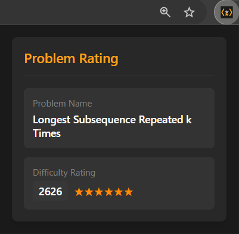
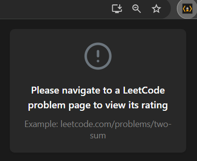

# LeetCode Problem Rating Extension

[](https://github.com/youruser/leetcode-rating)

A Chrome extension that displays competitive programming ratings for LeetCode problems, helping you choose problems that match your skill level.

## Features
- Display problem ratings from competitive programming contests
- Real-time rating updates
- Clean and intuitive interface
- Secure API key management

## Screenshots
<table style="width: 100%; border-collapse: collapse; border: none;">
  <tr>
    <td style="width: 50%; padding: 10px; ">
      
    </td>
    <td style="width: 50%; padding: 10px;">
      
    </td>
  </tr>
</table>


## Setup

### Prerequisites
- Chromium-based Browser
- CLIST API Key ([Get it here](https://clist.by/api/v4/doc/))

### Installation Steps
1. Clone the repository
   ```bash
   git clone https://github.com/youruser/leetcode-rating-extension.git
   cd leetcode-rating-extension
   ```

2. Configure API Key
   ```bash
   cp config.example.js config.js
   ```
   Edit `config.js` and replace `YOUR_API_KEY_HERE` with your CLIST API key


3. Load the Extension
   - Open Chrome
   - Navigate to `chrome://extensions/`
   - Enable "Developer Mode" in top-right corner
   - Click "Load unpacked"
   - Select the extension directory

## Usage
1. Pin the extension to your Chrome toolbar
2. Navigate to any LeetCode problem
3. View the problem's rating automatically

## Contributing
1. Fork the repository
2. Create your feature branch (`git checkout -b feature/improvement`)
3. Commit your changes (`git commit -m 'Add improvement'`)
4. Push to the branch (`git push origin feature/improvement`)
5. Open a Pull Request

## Acknowledgments
- CLIST API for providing rating data
- LeetCode platform
- All contributors specially <b>claude.ai</b>

## Contact
- GitHub Issues: [Create an issue](https://github.com/raosatyam/Clist-LeetCode-Extension/issues)
- Email: roronoaatwork@gmail.com