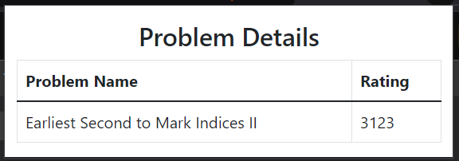

# LeetCode Problem Rating Extension

## Setup
1. Clone the repository
2. Copy `config.example.js` to `config.js`
3. Replace `YOUR_API_KEY_HERE` in `config.js` with your actual API key which you can get from [CLIST API Documentation](https://clist.by/api/v4/doc/)
4. Load the extension in Chrome

## Security Notes
- Never commit your `config.js` file with real API keys
- The API key will still be visible in the extension source code to users who inspect the extension
- For complete security, consider implementing a backend service that handles API calls

## Example Question Rating

Here is an example of how your extension can display the rating for a LeetCode problem:

